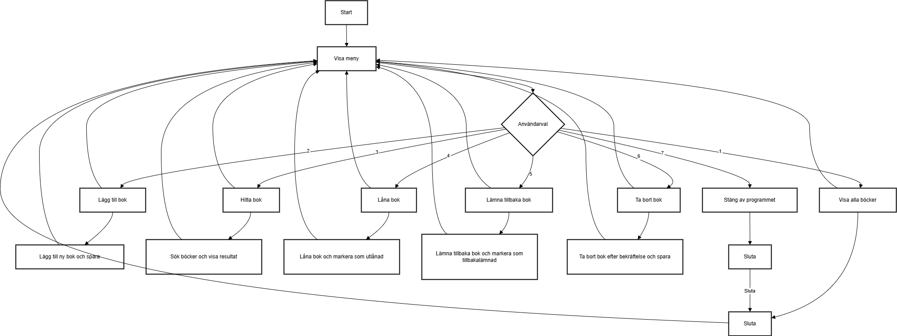

# Bibliotek Program

## Beskrivning
Det här är ett enkelt bibliotekshanteringssystem där du kan hålla koll på böcker, lägga till nya, låna böcker och ta bort böcker från din samling. Programmet läser och sparar böcker till en textfil och erbjuder flera funktioner för att interagera med din boklista.

## Funktioner
- **Visa alla böcker:** Se alla böcker i din samling.
- **Lägg till bok:** Lägg till en ny bok med namn och författare.
- **Hitta bok:** Sök efter böcker i din samling baserat på boknamn eller författare.
- **Låna bok:** Låna en bok från biblioteket.
- **Ge tillbaka bok:** Lämna tillbaka en lånad bok.
- **Ta bort bok:** Ta bort en bok permanent från biblioteket.
- **Spara böcker:** Alla ändringar sparas i en textfil så att dina böcker bevaras även efter att programmet stängs.

## Hur det fungerar
1. Programmet startar och försöker läsa böcker från en textfil (`minaBöcker.txt`).
2. Om filen inte finns, läggs några exempelböcker till och sparas.
3. Du får en meny med alternativ som låter dig visa böcker, lägga till böcker, söka efter böcker, låna böcker, och mer.
4. Programmet uppdaterar din boklista och sparar förändringarna i filen.

## Användning
1. **Kör programmet:** Starta programmet via din IDE eller kommandorad.
2. **Välj ett alternativ:** Följ instruktionerna på skärmen för att välja vad du vill göra (t.ex. visa böcker, lägga till en bok, låna en bok).
3. **Arbeta med böckerna:** Efter att du har valt ett alternativ, följ anvisningarna för att genomföra din åtgärd.